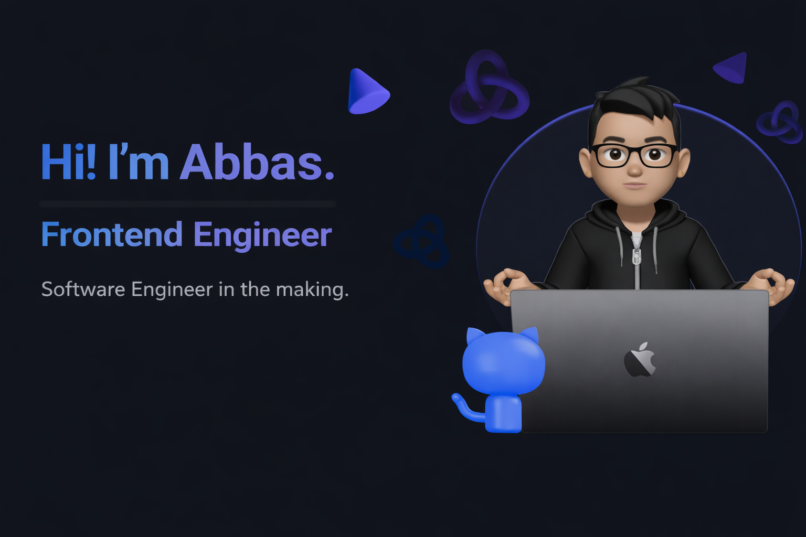

<!-- markdownlint-disable MD033 -->
<h1 align="center"><𝙿𝚛𝚘𝚏𝚒𝚕𝚎 /></h1>

---

- 💪🏼 Specialize in web development technologies like ,  with 
- 🚙 Worked on backend technologies like 
- 📚 Learning , , 

---

     

---

> 📗 If you're interested in collaborating or have any questions — I'd love to hear from you!
>
> 

>  
>   
>   
> 

  

